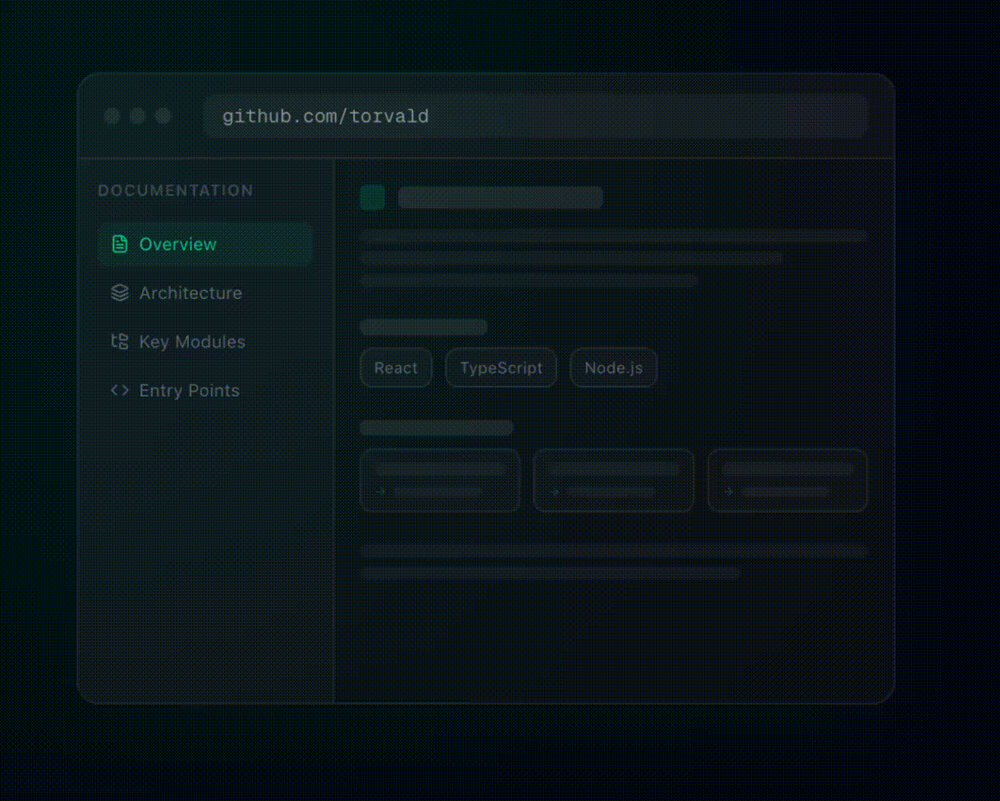

# QuickGitHub

AI-powered documentation for any GitHub repository. Just add "quick" to any GitHub URL.

`github.com/vercel/next.js` → `quickgithub.com/vercel/next.js`

🌐 **Try it now:** [quickgithub.com](https://quickgithub.com)



## ✨ What It Does

Paste any public GitHub repo URL and get a beautiful, multi-page documentation site in under 60 seconds:

- **System Overview** — what the project does, key features, getting started
- **Architecture** — component diagrams, data flow, Mermaid diagrams
- **Tech Stack** — languages, frameworks, databases, tools
- **Key Modules** — per-directory documentation with source file links
- **Entry Points** — main files, CLI commands, API endpoints
- **Dependencies** — categorized runtime and dev dependencies
- **Setup Guide** — prerequisites, installation, configuration, running, testing
- **Q&A Chat** — ask questions about the repo, powered by Claude Haiku

Already-indexed repos are served instantly from cache.

## 🏗 Architecture

```
Browser → Caddy (reverse proxy, auto-HTTPS)
              → Next.js 15 (App Router, NextAuth, SSE, API routes)
                    → Redis 7 (cache + job queue + rate limits)
                    → Go Worker (asynq job processor)
                          → GitHub API (fetch repo tree + files)
                          → Tree-sitter (parse source code)
                          → Claude API (generate documentation)
                    → PostgreSQL 16 (users, repos, docs, chat)
```

## 🛠 Tech Stack

| Component | Technology |
|-----------|-----------|
| Frontend | Next.js 15, TypeScript, Tailwind CSS, shadcn/ui |
| Auth | NextAuth.js v5 (GitHub OAuth) |
| Backend API | Next.js API Routes |
| Worker | Go, asynq (Redis-backed job queue) |
| Code Parsing | Tree-sitter (multi-language) |
| LLM | Claude Sonnet 4.5 + Haiku 4.5 (Anthropic API) |
| Database | PostgreSQL 16 (Prisma ORM) |
| Cache/Queue | Redis 7 |
| Reverse Proxy | Caddy (auto-HTTPS) |

## 📁 Project Structure

```
quickgithub/
├── web/                    # Next.js frontend + API
│   ├── prisma/             # Database schema
│   ├── src/
│   │   ├── app/            # App Router pages + API routes
│   │   ├── components/     # React components (docs/, chat/, ui/)
│   │   ├── lib/            # Prisma, Redis, auth, rate limiting
│   │   ├── hooks/          # SSE + chat hooks
│   │   └── types/          # TypeScript interfaces
│   └── package.json
├── worker/                 # Go background worker
│   ├── cmd/worker/         # Entry point
│   ├── internal/
│   │   ├── tasks/          # Job handler + types
│   │   ├── github/         # GitHub API client + file filtering
│   │   ├── parser/         # Tree-sitter parsing
│   │   ├── llm/            # Claude API client + pipeline
│   │   ├── notify/         # Email notifications (Resend)
│   │   ├── db/             # PostgreSQL client
│   │   ├── cache/          # Redis client
│   │   └── config/         # Configuration
│   └── go.mod
├── docker-compose.yml      # PostgreSQL + Redis
├── Caddyfile
└── Makefile
```

## 🚀 Development Setup

### Prerequisites

- Node.js 20+
- Go 1.22+
- Docker + Docker Compose
- GitHub OAuth app credentials
- Anthropic API key

### 1. Start databases

```bash
docker-compose up -d
```

### 2. Set up the web app

```bash
cd web
cp .env.example .env    # Fill in your credentials
npm install
npx prisma migrate dev
npm run dev
```

### 3. Set up the worker

```bash
cd worker
cp .env.example .env    # Fill in your credentials
go run cmd/worker/main.go
```

### Environment Variables

See `.env.example` files in `web/` and `worker/` directories.

## 📄 License

All rights reserved.
